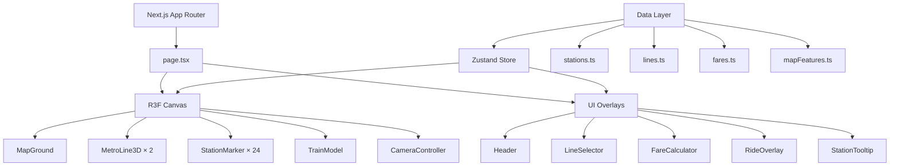

# Hanoi Metro 3D Map Simulation

Xây dựng ứng dụng mô phỏng 3D tuyến đường sắt trên cao Hà Nội sử dụng **Next.js + React Three Fiber (R3F)**, hiển thị 2 tuyến metro thực tế trên bản đồ Hà Nội với các tính năng tương tác cao cấp.

## User Review Required

> [!IMPORTANT]
> **Lựa chọn Framework**: Tôi đề xuất sử dụng **Next.js (App Router)** + React Three Fiber. Đây là lựa chọn tốt nhất cho SEO, routing, và performance. Bạn có đồng ý hay muốn sử dụng Vite thay thế?

> [!IMPORTANT]
> **Phạm vi tuyến Line 3**: Tuyến Nhổn - Ga Hà Nội hiện chỉ vận hành 8 ga trên cao (Nhổn → Cầu Giấy). 4 ga ngầm (Kim Mã, Cát Linh, Văn Miếu, Ga Hà Nội) đang xây dựng. Tôi sẽ hiển thị **cả 12 ga** nhưng đánh dấu 4 ga ngầm là "đang xây dựng" với style khác biệt (đường nét đứt, màu nhạt). Bạn có đồng ý?

> [!WARNING]
> **Bản đồ nền**: Thay vì tích hợp Google Maps/Mapbox (phức tạp + cần API key + phí), tôi sẽ tạo **bản đồ stylized** riêng với các đường chính, sông Hồng, hồ chính (Tây Hồ, Hoàn Kiếm) dựa trên tọa độ thực. Bản đồ sẽ có phong cách minimalist, tập trung vào metro lines. Bạn có đồng ý hay muốn tích hợp map API?

## Open Questions

> [!NOTE]
> **Ngôn ngữ UI**: Ứng dụng sẽ hiển thị bằng tiếng Việt hay song ngữ Việt-Anh?

> [!NOTE]
> **Responsive**: Bạn có cần hỗ trợ mobile hay chỉ cần desktop?

---

## Dữ liệu đã nghiên cứu

### Tuyến 2A: Cát Linh – Hà Đông (12 ga)

| Mã ga | Tên ga | Latitude | Longitude |
|:---:|:---|:---:|:---:|
| C01 | Cát Linh | 21.02806 | 105.82722 |
| C02 | La Thành | 21.02028 | 105.82528 |
| C03 | Thái Hà | 21.01444 | 105.81944 |
| C04 | Láng | 21.01250 | 105.81194 |
| C05 | Thượng Đình | 21.00444 | 105.80806 |
| C06 | Vành Đai 3 | 20.99222 | 105.80444 |
| C07 | Phùng Khoang | 20.98500 | 105.79417 |
| C08 | Văn Quán | 20.97778 | 105.78472 |
| C09 | Hà Đông | 20.97028 | 105.77500 |
| C10 | La Khê | 20.96389 | 105.76667 |
| C11 | Văn Khê | 20.95556 | 105.75611 |
| C12 | Yên Nghĩa | 20.94972 | 105.74833 |

**Giá vé lượt (tiền mặt)**: 9,000đ (1 ga) → 19,000đ (toàn tuyến 12 ga)  
**Công thức tính giá**: ~9,000đ + ~909đ × (số ga - 1), làm tròn

### Tuyến 3: Nhổn – Ga Hà Nội (12 ga)

| Mã ga | Tên ga | Latitude | Longitude | Trạng thái |
|:---:|:---|:---:|:---:|:---|
| S01 | Nhổn | 21.05259 | 105.73523 | Hoạt động |
| S02 | Minh Khai | 21.04806 | 105.74472 | Hoạt động |
| S03 | Phú Diễn | 21.04389 | 105.75528 | Hoạt động |
| S04 | Cầu Diễn | 21.04111 | 105.76278 | Hoạt động |
| S05 | Lê Đức Thọ | 21.03806 | 105.77306 | Hoạt động |
| S06 | Đại học Quốc gia | 21.03667 | 105.78278 | Hoạt động |
| S07 | Chùa Hà | 21.03333 | 105.78333 | Hoạt động |
| S08 | Cầu Giấy | 21.02944 | 105.80333 | Hoạt động |
| S09 | Kim Mã | 21.03056 | 105.81417 | 🚧 Đang xây dựng |
| S10 | Cát Linh | 21.02806 | 105.82722 | 🚧 Đang xây dựng |
| S11 | Văn Miếu | 21.02667 | 105.83639 | 🚧 Đang xây dựng |
| S12 | Ga Hà Nội | 21.02500 | 105.84100 | 🚧 Đang xây dựng |

**Giá vé lượt (tiền mặt - 8 ga đang hoạt động)**: 9,000đ → 15,000đ

> [!NOTE]
> Ga Cát Linh (S10) trùng tọa độ với ga Cát Linh (C01) của tuyến 2A — đây là điểm trung chuyển giữa 2 tuyến.

---

## Proposed Changes

### 1. Project Setup & Configuration

#### [NEW] package.json, next.config.js, tsconfig.json
- Khởi tạo dự án Next.js (App Router) với TypeScript
- Dependencies chính:
  - `next`, `react`, `react-dom`
  - `three`, `@react-three/fiber`, `@react-three/drei`
  - `zustand` (state management)
  - `@types/three`

---

### 2. Data Layer

#### [NEW] src/data/stations.ts
Chứa toàn bộ dữ liệu ga, tọa độ GPS, thông tin chi tiết:
```typescript
interface Station {
  id: string;           // "C01", "S01"
  name: string;         // "Cát Linh"
  nameEn?: string;      // "Cat Linh"
  lineId: string;       // "line-2a" | "line-3"
  lat: number;
  lng: number;
  status: 'active' | 'construction';
  description: string;  // Mô tả vị trí, khu vực
  address: string;      // Địa chỉ cụ thể
}
```

#### [NEW] src/data/lines.ts
Thông tin tuyến đường:
```typescript
interface MetroLine {
  id: string;
  name: string;
  nameShort: string;    // "2A", "3"
  color: string;        // Màu tuyến (#HEX)
  stations: string[];   // Station IDs theo thứ tự
  totalLength: string;  // "13.1 km"
  operatingHours: string;
  frequency: string;    // "10 phút/chuyến"
}
```

#### [NEW] src/data/fares.ts
Bảng giá vé chi tiết:
```typescript
interface FareTable {
  lineId: string;
  fares: {
    fromStationId: string;
    toStationId: string;
    cashPrice: number;     // VND
    cardPrice: number;     // VND (không tiền mặt)
  }[];
}
// Tính theo công thức: basePrice + increment * numberOfStops
```

#### [NEW] src/data/mapFeatures.ts
Dữ liệu bản đồ stylized: đường chính, sông, hồ (polylines/polygons):
```typescript
interface MapFeature {
  type: 'river' | 'lake' | 'road' | 'district';
  name: string;
  coordinates: [number, number][];  // [lat, lng] pairs
  style: { color: string; width?: number; opacity?: number };
}
```

---

### 3. State Management

#### [NEW] src/store/useMetroStore.ts
Zustand store quản lý toàn bộ state:
```typescript
interface MetroState {
  // Active line selection
  selectedLineId: string | null;
  setSelectedLine: (id: string | null) => void;
  
  // Station hover/selection
  hoveredStationId: string | null;
  setHoveredStation: (id: string | null) => void;
  
  // Fare calculator
  fromStationId: string | null;
  toStationId: string | null;
  setFromStation: (id: string | null) => void;
  setToStation: (id: string | null) => void;
  
  // Test ride
  isRiding: boolean;
  rideProgress: number;  // 0 → 1
  rideLineId: string | null;
  startRide: (lineId: string) => void;
  stopRide: () => void;
  
  // Camera
  cameraMode: 'overview' | 'line-focus' | 'riding';
}
```

---

### 4. 3D Components (React Three Fiber)

#### [NEW] src/components/3d/MetroScene.tsx
Canvas chính chứa toàn bộ scene 3D:
- `<Canvas>` với camera perspective
- Lighting setup (ambient + directional)
- OrbitControls cho navigation
- Post-processing effects (bloom cho đèn ga)

#### [NEW] src/components/3d/MapGround.tsx
Bản đồ nền stylized của Hà Nội:
- Mặt phẳng ground với texture/gradient tối (dark mode)
- Sông Hồng, sông Tô Lịch (curved meshes, màu xanh nước)
- Hồ chính: Hồ Tây, Hồ Hoàn Kiếm (circular/oval meshes)
- Grid đường chính (thin lines, subtle)
- Tên quận/khu vực (Text3D hoặc Html overlay)

#### [NEW] src/components/3d/MetroLine3D.tsx
Render 1 tuyến metro:
- Sử dụng `THREE.CatmullRomCurve3` tạo đường cong mượt qua các ga
- `<TubeGeometry>` cho đường ray với emission glow
- Màu sắc theo tuyến (Line 2A: xanh lá #00B14F, Line 3: đỏ cam #E5441B)
- Hiệu ứng mờ/sáng khi selected/unselected (opacity transition)
- Dấu nét đứt cho đoạn đang xây dựng (Line 3: Kim Mã → Ga HN)

#### [NEW] src/components/3d/StationMarker.tsx
Render 1 ga trên bản đồ:
- Hình trụ/cầu 3D tại vị trí ga
- Hiệu ứng glow/pulse khi hover
- Scale animation khi selected
- Màu khác cho ga đang xây dựng (xám/outline)
- `<Html>` overlay cho tooltip khi hover:
  - Tên ga, mã ga
  - Địa chỉ
  - Trạng thái hoạt động
  - Nút "Chọn làm điểm đi/đến"

#### [NEW] src/components/3d/TrainModel.tsx
Mô hình tàu metro 3D đơn giản:
- Low-poly box-based train model (tự tạo bằng Three.js primitives)
- Màu theo tuyến
- Animation di chuyển dọc curve khi "Đi thử"
- Headlight glow effect
- Sử dụng `useFrame` để update position along curve

#### [NEW] src/components/3d/CameraController.tsx
Điều khiển camera thông minh:
- Overview mode: nhìn toàn cảnh Hà Nội từ trên cao
- Line focus: zoom vào tuyến được chọn, góc nghiêng
- Riding mode: camera follow theo tàu, góc nhìn từ trên/bên cạnh
- Smooth transitions giữa các mode (lerp/damp)

---

### 5. UI Components (React / HTML Overlay)

#### [NEW] src/components/ui/LineSelector.tsx
Panel chọn tuyến ở dưới cùng màn hình:
- 2 cards cho 2 tuyến metro
- Hiển thị tên, số ga, chiều dài, màu tuyến
- Active state khi được chọn (border glow, scale up)
- Nút "Đi thử" trên mỗi card

#### [NEW] src/components/ui/StationTooltip.tsx
Tooltip hiện khi hover vào ga (rendered inside R3F `<Html>`):
- Tên ga (VN), mã ga
- Trạng thái hoạt động
- Mô tả vị trí
- Buttons: "Điểm đi" / "Điểm đến"

#### [NEW] src/components/ui/FareCalculator.tsx
Panel tính giá vé:
- Hiển thị ga đi và ga đến đã chọn
- Giá vé tiền mặt và không tiền mặt
- Số ga di chuyển, thời gian ước tính
- Animation route highlight trên bản đồ
- Nút reset

#### [NEW] src/components/ui/RideOverlay.tsx
Overlay khi đang "Đi thử":
- Progress bar (% hành trình)
- Tên ga hiện tại / ga tiếp theo
- Thời gian ước tính
- Nút dừng / tăng tốc
- Thông tin ga flashing khi đi qua

#### [NEW] src/components/ui/Header.tsx
Header của ứng dụng:
- Logo "Hanoi Metro Map"
- Nút chuyển đổi light/dark mode (mặc định dark)
- Legend màu tuyến

---

### 6. Layout & Pages

#### [NEW] src/app/page.tsx
Trang chính:
- Full-viewport 3D canvas
- UI overlays positioned absolute
- Layout:
  ```
  ┌──────────────────────────────────┐
  │  Header (Logo, Legend)           │
  ├──────────────────────────────────┤
  │                                  │
  │         3D Metro Scene           │
  │    (Full viewport canvas)        │
  │                                  │
  │   ┌─────────────┐               │
  │   │  Fare Panel  │  (khi chọn)  │
  │   └─────────────┘               │
  ├──────────────────────────────────┤
  │  Line Selector (Bottom Bar)      │
  └──────────────────────────────────┘
  ```

#### [NEW] src/app/layout.tsx
Root layout:
- Google Fonts (Inter / Be Vietnam Pro)
- Global CSS
- SEO metadata

#### [NEW] src/app/globals.css
Design system:
- CSS Variables cho color palette
- Dark mode mặc định
- Glassmorphism cho panels
- Animations keyframes
- Typography scale

---

### 7. Utilities

#### [NEW] src/utils/coordinates.ts
Chuyển đổi tọa độ:
```typescript
// Chuyển GPS (lat, lng) → 3D coordinates (x, z)
// Sử dụng Mercator projection đơn giản
// Center point: trung tâm Hà Nội (~21.02, 105.80)
function gpsTo3D(lat: number, lng: number): [number, number, number]

// Tính khoảng cách giữa 2 ga
function distanceBetweenStations(s1: Station, s2: Station): number
```

#### [NEW] src/utils/fareCalculator.ts
Tính giá vé:
```typescript
function calculateFare(
  fromId: string, 
  toId: string, 
  paymentMethod: 'cash' | 'card'
): { price: number; stops: number; estimatedTime: number }
```

---

## Kiến trúc tổng quan



---

## Tính năng chi tiết

### 1. View toàn cảnh
- Camera ban đầu ở góc top-down, nhìn xuống toàn Hà Nội
- Cả 2 tuyến metro hiển thị với màu riêng biệt
- Các ga hiển thị như điểm sáng trên tuyến
- Sông Hồng, hồ, đường chính tạo context bản đồ

### 2. Hover thông tin ga
- Khi hover vào điểm ga → tooltip hiện lên với thông tin
- Ga phát sáng (emissive effect)
- Tooltip chứa: tên, mã, địa chỉ, trạng thái
- 2 nút: "Chọn điểm đi" / "Chọn điểm đến"

### 3. Chọn điểm tính giá vé
- Click ga 1 → đánh dấu "Điểm đi" (marker xanh)
- Click ga 2 → đánh dấu "Điểm đến" (marker đỏ)
- Đoạn đường giữa 2 ga highlight sáng
- Panel giá vé hiện ra với: giá tiền mặt, giá thẻ, số ga, thời gian

### 4. Chọn tuyến (Highlight)
- Bottom bar có 2 cards tuyến
- Click tuyến → camera zoom vào tuyến đó
- Tuyến được chọn: sáng, glow, full opacity
- Tuyến không được chọn: mờ đi (opacity 0.15)
- Click lại → deselect, về overview

### 5. Đi thử (Test Ride)
- Nút "Đi thử" trên card tuyến
- Camera chuyển sang follow mode
- Tàu metro 3D xuất hiện tại ga đầu
- Di chuyển dọc tuyến từ ga đầu → ga cuối
- Khi qua mỗi ga: hiệu ứng flash, hiện tên ga
- Progress bar hiển thị tiến trình
- Có thể tăng tốc (×1, ×2, ×4) hoặc dừng

---

## Design System

### Color Palette
```
Background:     #0a0e1a (deep navy)
Surface:        #1a1f35 (card background)
Surface Glass:  rgba(26, 31, 53, 0.85) + backdrop-blur
Primary:        #4f8cff (accent blue)
Line 2A:        #00B14F (green) — Cát Linh – Hà Đông
Line 3:         #E5441B (orange-red) — Nhổn – Ga Hà Nội
Text Primary:   #e8ecf4
Text Secondary: #8892a8
Water:          #1a3a5c (rivers, lakes)
Construction:   #555b6e (under construction markers)
```

### Typography
- **Font**: "Be Vietnam Pro" (Google Fonts) — phù hợp tiếng Việt
- Headings: 600 weight
- Body: 400 weight

### Effects
- Glassmorphism panels (`backdrop-filter: blur(20px)`)
- Neon glow cho metro lines (`emissive` material + bloom)
- Pulse animation cho stations
- Smooth camera transitions (spring physics)
- Particle effects cho train movement

---

## Verification Plan

### Automated Tests
```bash
npm run build          # Verify Next.js builds without errors
npm run lint           # ESLint check
npx tsc --noEmit       # TypeScript type check
```

### Manual Verification
1. **Visual**: Mở app, kiểm tra 2 tuyến metro hiển thị đúng vị trí trên bản đồ
2. **Hover**: Hover vào từng ga, kiểm tra tooltip hiện đúng thông tin
3. **Fare**: Chọn 2 ga, kiểm tra giá vé khớp với bảng giá thực tế
4. **Line Selection**: Click tuyến ở bottom bar, kiểm tra highlight/dim đúng
5. **Test Ride**: Click "Đi thử", kiểm tra tàu di chuyển mượt qua tất cả ga
6. **Camera**: Kiểm tra chuyển đổi camera giữa overview/focus/ride mode
7. **Performance**: Đảm bảo 60fps trên browser desktop
